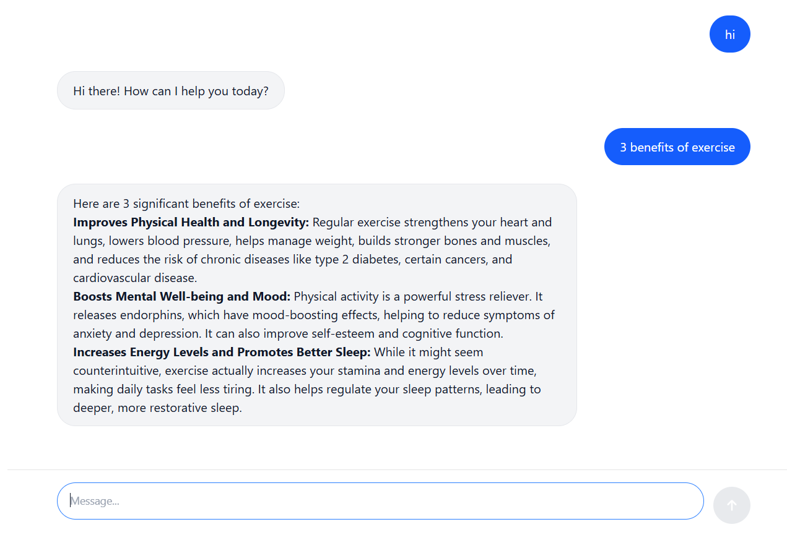

# AI ChatBot

A modern, real-time chat application powered by Google's Gemini AI with conversation history management.

## Features

- 💬 Real-time AI chat interface
- 🔄 Conversation history persistence
- ⚡ Smooth typing animations
- 📱 Responsive design
- 🎨 Clean, modern UI with hidden scrollbars
- ⌨️ Keyboard shortcuts (Enter to send, Shift+Enter for new line)

## Tech Stack

**Frontend:**

- React with TypeScript
- React Hook Form for form management
- Axios for API calls
- React Markdown for message rendering
- Tailwind CSS for styling

**Backend:**

- Express.js
- Google Generative AI (Gemini)
- Zod for validation
- TypeScript

